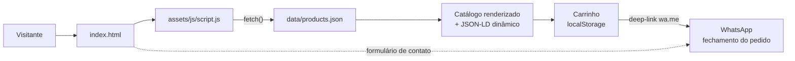

# Rosa Encantada by Lorraine

Site institucional e catálogo da Rosa Encantada by Lorraine, marca artesanal de chocolates (trufas, rosas de chocolate, buquês e cestas de presente). É uma single-page em HTML/CSS/JS puro, sem framework e sem etapa de build: o catálogo vive em um JSON, o carrinho fica no `localStorage` do navegador e o pedido é finalizado por deep-link de WhatsApp. Não há backend.

Produção: https://rosaencantada.vercel.app

## Arquitetura



O `index.html` concentra todas as seções (hero, produtos, encomendas, contato) e um `<script type="application/ld+json">` com `@graph` de entidades SEO (`Organization`, `LocalBusiness`, `FAQPage`, `HowTo`, `Product`, etc.). O `script.js` complementa injetando um `ItemList` gerado a partir do catálogo. Produtos podem ser `customizable` (seletor de sabores, ex.: Rosa Encantada e Buquê de Rosas). Há tema claro/escuro via atributo `data-theme`.

## Stack

| Camada | Tecnologia |
| --- | --- |
| Marcação | HTML5 único (`index.html` + `404.html`) |
| Estilo | CSS puro escrito à mão (`assets/css/styles.css`), sem preprocessor |
| Comportamento | JavaScript vanilla (`assets/js/script.js`) |
| Dados | `data/products.json` (catálogo canônico, carregado via `fetch`) |
| Estado | `localStorage` (chave `rosa-cart`) |
| Checkout | Deep-link `wa.me` (WhatsApp) |
| SEO | Meta tags, OpenGraph, Twitter cards, sitemap, JSON-LD estático + dinâmico |
| Hospedagem | Vercel (`vercel.json`: cleanUrls, CSP e headers de segurança, cache) |
| Utilitários | Scripts PowerShell (`scripts/`), sem dependências externas |

## Layout do repositório

```
/
├── index.html, 404.html          # entry points (ficam na raiz)
├── robots.txt, sitemap.xml, humans.txt, site.webmanifest
├── vercel.json                   # headers, CSP, cache, cleanUrls (produção)
├── .vercelignore                 # exclui docs, scripts e vault do deploy
├── .htaccess                     # legado do deploy Hostinger (Apache/LiteSpeed)
├── assets/
│   ├── css/styles.css
│   ├── js/script.js
│   ├── img/                      # logo, mascote e fotos de produto (800x800)
│   └── social/                   # og-image e twitter-card (svg + jpg)
├── data/
│   └── products.json             # catálogo: editar aqui = editar o site
├── scripts/                      # helpers PowerShell (ver tabela abaixo)
├── docs/
│   └── DEPLOY-HOSTINGER.md       # runbook do deploy legado na Hostinger
└── obsidian_rosaencantada/       # vault de notas da dona - não é código
```

Os caminhos referenciados em HTML, JSON-LD e sitemap são relativos à raiz. Mover arquivos exige atualizar `index.html`, `404.html`, `site.webmanifest`, `sitemap.xml` e `assets/js/script.js`.

## Como rodar local

Não há dependências para instalar, mas é preciso servir os arquivos por HTTP - o `fetch('data/products.json')` falha em `file://` por CORS. Da raiz do projeto:

```powershell
python -m http.server 8000
# ou
npx serve .
```

Depois abra `http://localhost:8000/`.

## Scripts

Helpers PowerShell, sem dependências externas (usam `System.Drawing`). Rodar da raiz do projeto.

| Script | O que faz |
| --- | --- |
| `.\scripts\update-site.ps1` | Find/replace em lote de domínio, WhatsApp e telefone por todos os arquivos texto. Editar o array `$replacements` no topo antes de rodar. |
| `.\scripts\convert-images.ps1` | Gera `assets/social/og-image.jpg` e `twitter-card.jpg` a partir do zero. Re-rodar após mudança visual da marca. |
| `.\scripts\optimize-products.ps1` | Corta as fotos de produto em quadrado, redimensiona para 800x800 e salva JPG comprimido em `assets/img/products/`. Originais vão para `_src/` (gitignored). |

Não há build, test runner nem linter.

## Deploy

O site é servido pelo **Vercel** como estático puro:

- `vercel.json` define `cleanUrls`, headers de segurança (CSP estrita, HSTS, `X-Frame-Options`, etc.) e cache imutável de 1 ano para `assets/`.
- `.vercelignore` mantém fora do deploy o que não é site: `docs/`, `scripts/`, `obsidian_rosaencantada/`, `.htaccess` e arquivos de tooling.
- Não há workflows de GitHub Actions neste repositório.

Atenção à CSP: adicionar qualquer host de terceiros (script, fonte, imagem) exige atualizar a diretiva em `vercel.json`, ou o recurso é bloqueado em produção.

O `.htaccess` e o `docs/DEPLOY-HOSTINGER.md` documentam o deploy anterior em hospedagem compartilhada Hostinger (Apache + LiteSpeed) e são mantidos como referência.

## Fluxo de trabalho

- `main` - produção; `develop` - desenvolvimento.
- Dados de produto mudaram? Editar `data/products.json` e manter o JSON-LD estático do `index.html` em sincronia (nomes, preços, descrições).
- Todo o conteúdo do site é em português do Brasil.
